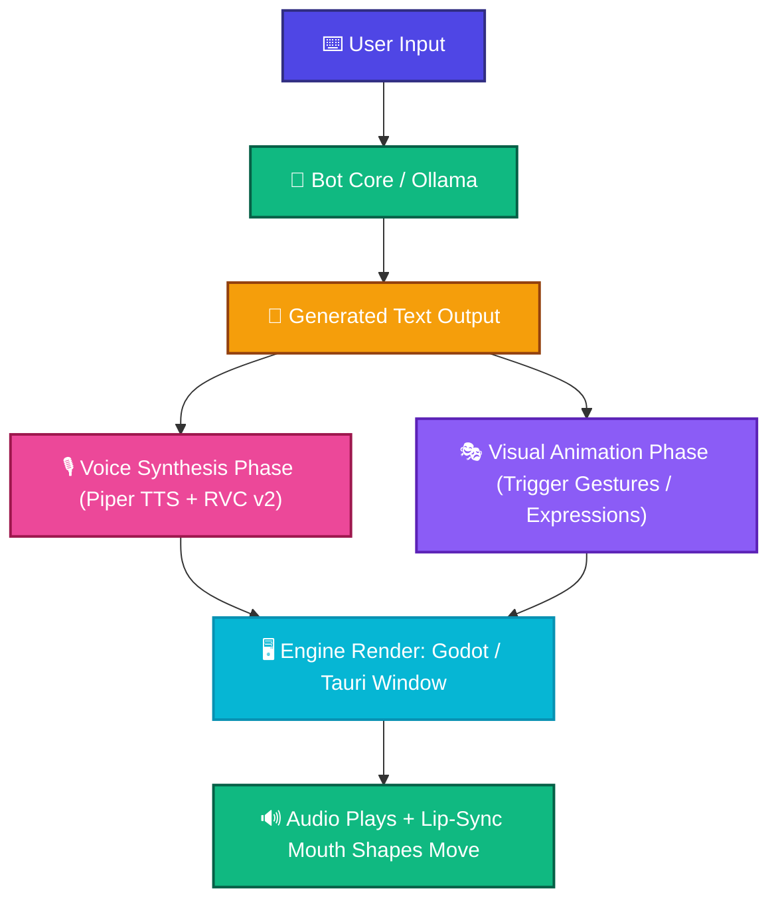

# 🎙️ Diana AI - Project Concept & Visual Engine Architecture

This document defines the core identity of the **Diana desktop companion** and the visual rendering architecture required to bring her into your workspace as a moving, responsive, and fully interactive entity.

---

## 📌 1. The Core Project Idea

The goal is to build a **fully localized, intelligent, and persistent 3D desktop companion** based on the android character Diana from Capcom's *Pragmata*. Unlike traditional chatbots that sit hidden in a browser tab or a terminal window, Diana is designed to live *on* your desktop environment as a continuous, dynamic presence.

### 🌟 Key Philosophy

* **🔒 Absolute Privacy & Zero Cost:** Every component—from text generation to voice processing and 3D rendering—runs 100% locally on your hardware. There are no external API calls, token subscription costs, or data privacy risks.
* **🎭 Immersive Personality:** She behaves with the natural, wide-eyed curiosity of an android exploring a human interface environment, reacting dynamically to system events, user interaction, and conversation.
* **🖥️ System-Aware Presence:** She isn't just an overlay; she functions as an interactive layer capable of tying directly into your existing bot backend and automation scripts.

---

## 📐 2. The Visual & Animation Model (VRM)

To handle real-time 3D rendering with minimal performance overhead, the project relies on the **VRM file format** (`.vrm`).

### ❓ Why VRM?

* **🌐 Open Standard:** Built specifically for human-like avatars (highly popular in VTubing applications), making it universally compatible with lightweight rendering engines.
* **✨ Built-in Physics & Expressions:** VRM models store skeletal rigs, hair/clothing physics, and facial blend shapes directly in a single compact file. This allows for fluid idle animations (blinking, swaying) out of the box.
* **👄 Expression Mapping:** The format uses standardized mouth shape keys (A, I, U, E, O). This allows you to drive realistic lip-syncing automatically by analyzing the audio frequencies generated from your local voice pipeline.

---

## ⚙️ 3. The Rendering Engine Options

To display a 3D avatar on your desktop without background boxes, the rendering engine must support **borderless, click-through, and transparent window properties** natively on Linux (X11/Wayland).

Two technical paths fit this perfectly:

### 📊 Route Comparison

| Feature/Aspect | 🎮 Route A: Godot Engine (Recommended) | 🌐 Route B: Tauri + Three.js (Web Stack) |
| :--- | :--- | :--- |
| **Primary Stack** | GDScript or C# + Community VRM Loader | Rust Backend + HTML/CSS/JS (Three.js WebGL) |
| **Performance** | Ultra-lightweight, extremely low GPU/CPU footprint | Moderate, runs inside a standard Webview container |
| **Physics Handling**| Superior real-time bone and spring physics out-of-the-box | Requires complex JS-based physics configurations |
| **Lip-Sync Drive** | Direct native audio buffer sampling for blend shapes | Analyzes audio stream in JS using Web Audio API |
| **UI Customization**| Game engine UI node system | Fully customizable via Tailwind CSS, Svelte, or React |
| **Use Case** | **Best for raw 3D performance and realistic physics** | **Best if you want complex web-styled UI overlays** |

> [!TIP]
> **Recommendation:** If your primary focus is fluid character physics (hair/clothes sway) and absolute minimal CPU usage, **Route A (Godot)** is the superior choice. If you prefer to design rich visual menus, notification popups, or chat Bubbles using HTML/CSS, **Route B (Tauri)** is highly flexible.

---

## 🔄 4. Unified Project Flow

When complete, the entire visual and conversational cycle works in a loop coordinated by your central backend script:

